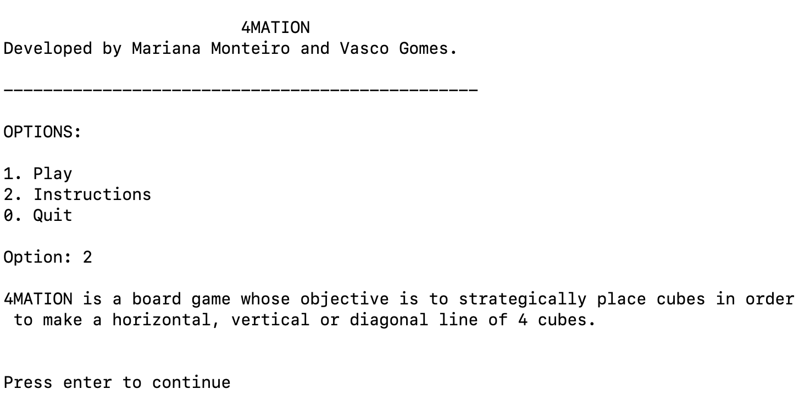
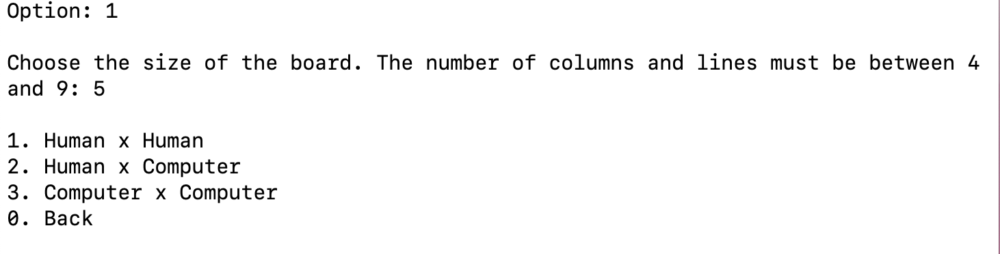
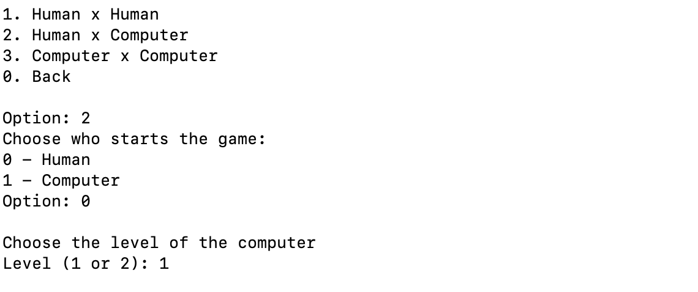
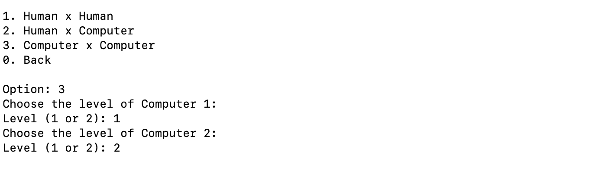

# 4Mation

## Identificação do trabalho

**Grupo:** 4Mation_1

up201906617 - Vasco David Antunes Pereira Gomes - 50%
up202003480 - Mariana Mirra Monteiro - 50%

## Instalação e Execução

incluir todos os passos necessários para correta execução do jogo em
ambientes Linux e Windows (para além da instalação do SICStus Prolog 4.7);

## Descrição do Jogo

4Mation é um jogo de tabuleiro cujo objetivo é colocar cubos estrategicamente de forma a fazer uma linha horizontal, vertical ou diagonal de 4 cubos.

4Mation é um jogo para dois jogadores, em que cada um fica com todos os cubos de uma determinada cor. Em seguida, os jogadores jogam em turnos colocando apenas 1 cubo por turno com apenas uma restrição: cada cubo tem de ser colocado num espaço que é adjacente (verticalmente, horizontalmente ou diagonalmente) ao último cubo colocado pelo adversário. O jogo termina assim que um jogador consiga fazer uma linha vertical, horizontal ou diagonal com 4 cubos da sua cor. Caso nenhum jogador consiga completar uma linha de 4 cubos, o jogo termina empatado.

[Mais informações.](https://boardgamegeek.com/boardgame/329175/4mation)

## Lógica do Jogo

>Representação interna do estado do jogo

O tabuleiro é representado por uma lista de listas que podem ser consultadas usando o predicado board(+Board, +I-J,-Player), ou seja na posição (I,J) existe um cubo colocado pelo Jogador (Player). Se não houver cubo Player retorna 0.

O estado de jogo é representado pela estrutura gamestate(Board, Turn, I-J), onde (I-J) representa o último cubo colocado pelo adversário. Turn representa o turno atual da jogada onde os números ímpares representam a vez do jogador 1 e os pares a vez do jogador 2.

#### Estado Inicial
```
gamestate(
  [
  [0,0,0,0,0],
  [0,0,0,0,0],
  [0,0,0,0,0],
  [0,0,0,0,0],
  [0,0,0,0,0]
  ],
  1,nan-nan
  )
```
#### Estado Intermédio
```
gamestate(
  [
  [2,0,0,0,0],
  [1,1,2,0,0],
  [1,2,1,0,0],
  [0,0,1,2,0],
  [0,0,0,0,0]
  ],
  10,3-0
  )
```
#### Estado Final
```
gamestate(
  [
  [2,0,1,2,0],
  [1,1,2,2,2],
  [1,2,1,1,1],
  [2,1,1,2,2],
  [2,1,2,1,0]
  ],
  23,0-3
  )
```
nota sobre o nan
>Visualização do estado de jogo

Após fazer a consulta de game.pl, para entrar no jogo tem de utilizar o predicado play.. De seguida, é apresentado um pequeno menu com as opções 1.play, 2.Instructions e por fim 0.Quit



Caso escolha a opção 1 (play), terá de escolher o tamanho do tabuleiro e de seguida um dos 3 modos de jogo ou voltar para trás.



Caso escolha as opções 2 ou 3 terá de escolher o nível de dificuldade do computador. E se escolher a opção 2 terá de indicar quem é o primeiro a jogar.





meter aqui a representação estado de jogo por fotos?

fizemos todos os cenarios possiveis que são pedidos

>Execução de jogadas

Uma jogada é válida se:

* A jogada é adjacente à jogada anterior;
* Se a célula está vazia.

O predicado move(+GameState, +Move, -NewGameState) é responsável pela execução de uma jogada. Os predicados is_adjacent(+I1-J1,+I2-J2) e board(+Board,+I-J,?Player) são responsáveis pela validação das jogadas, onde o primeiro predicado verifica se a jogada foi adjacente à anterior e o segundo se a célula está vazia.

>Final do Jogo

O predicado game_over(+GameState,-Winner) é o responsável para verificação da situação do fim do jogo. Este predicado verifica primeiro se algum dos jogadores ganhou a partida e, caso não tenham ganho, se a partida terminou empatada. Esta ordem é importante uma vez que a partida acaba empatada quando um jogador não tem jogadas válidas mas o jogador anterior pode ter ganho a partida e por isso deve ser verificado primeiro se algum dos jogadores tem 4 dos seus cubos consecutivos. Para esta verificação, é feita uma análise do tabuleiro por linhas horizontais, verticais e nos dois sentidos diagonais focando-se apenas no último jogador (se foi o turno do Jogador 1, a jogada dele nada influencia na vitória do jogador 2). Para a verificação do empate, fazemos uma negação ao predicado has_valid_moves(+GameState). Em caso de empate, Winner ficará a 0 e em caso de vitória ficará com o jogador vencedor.

>Lista de jogadas válidas
